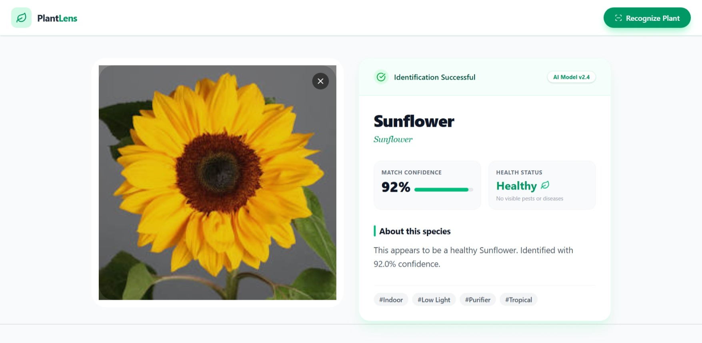

# 🌿 Plant Recognizer

A full-stack AI application for identifying plant species. It features a modern **React + Vite** frontend with a beautiful UI and a **FastAPI + TensorFlow Lite** backend for highly optimized, real-time inference using the MobileNet-based AIY Plants model.



## 🚀 Features

*   **Real-time Recognition**: Upload any plant image and get instant identification.
*   **Optimized AI**: Migrated to **TensorFlow Lite (TFLite)** for 90% smaller package size and faster inference.
*   **Interactive UI**: Drag-and-drop uploads, live previews, and detailed results card.
*   **Result Insights**:
    *   Scientific Name & Common Name
    *   Confidence Score
    *   Health Status Check
    *   Detailed Description

## 🛠️ Technology Stack

*   **Frontend**: React, Vite, Tailwind CSS, Lucide React
*   **Backend**: FastAPI, Python 3.9+, Uvicorn
*   **AI/ML**: TensorFlow Lite, NumPy, Pillow

## 📦 Installation & Setup

### Prerequisites
*   Node.js (v18+)
*   Python (v3.9+)

### 1. Clone the Repository
```bash
git clone https://github.com/dineshingale/Plant-Recognizer.git
cd Plant-Recognizer
```

### 2. Backend Setup
Set up the Python server.

```bash
# Create virtual environment
python -m venv venv

# Activate (Windows)
.\venv\Scripts\activate

# Activate (Mac/Linux)
source venv/bin/activate

# Install dependencies
pip install -r requirements.txt
```

### 3. Model Setup (Important!)
Since we use a TFLite optimized model, you must generate/download it first.

```bash
# Run this script once to download and convert the model
python convert_model.py
```
> This will generate a `plants.tflite` file in your root directory.

### 4. Run the Server
```bash
python server.py
```
> The API will available at `http://localhost:8000`

### 5. Frontend Setup
Launch the React Client interface.

```bash
# Open a new terminal and navigate to Client
cd Client

# Install dependencies
npm install

# Run Development Server
npm run dev
```
> The app will open at `http://localhost:5173`

## 📖 Usage Guide

1.  Ensure both **Server** (port 8000) and **Client** (port 5173) are running.
2.  Open `http://localhost:5173`.
3.  **To Identify a Plant:**
    *   Drag & drop an image onto the upload zone.
    *   Or click to browse your files.
    *   Click the **Recognize Plant** button.
4.  View the detailed results including confidence score and species info.

## 📂 Project Structure

```
Plant-Recognizer/
├── Client/                 # React Frontend
│   ├── src/
│   │   ├── components/     # UI Components
│   │   ├── App.jsx         # Main Logic
│   │   └── main.jsx        # Entry Point
│   └── package.json
├── src/                    # Legacy CLI Script
├── convert_model.py        # Script to generate TFLite model
├── plants.tflite           # Optimized Model File (Generated)
├── server.py               # FastAPI Backend Server
├── requirements.txt        # Python Dependencies
└── run.py                  # Helper Script
```

## 🤖 Model Details

This project uses the **Google AIY Plants V1** model, converted to **TFLite**:
*   **Source**: [TensorFlow Hub](https://tfhub.dev/google/aiy/vision/classifier/plants_V1/1)
*   **Optimization**: Quantized/Float16 TFLite format for rapid CPU inference.
*   **Input**: 224x224 RGB Images

---
*Built with 💚 using React & Python*
